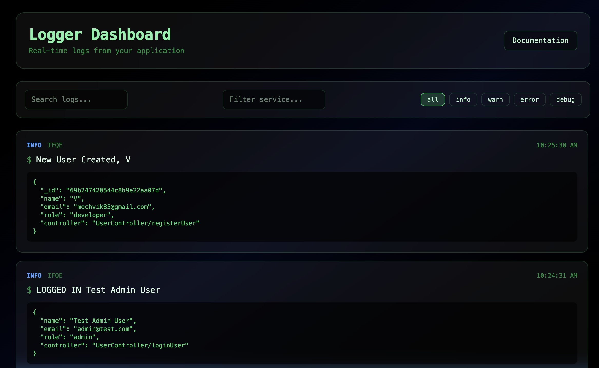

A lightweight **real-time logging and observability platform** for Node.js applications.

# LogFlow 🚀

A lightweight **real-time logging and observability platform** for Node.js applications.

LogFlow allows developers to **stream, process, store, and visualize logs** from multiple services in one place.

 [🚀 Visit LogFlow Dashboard](https://logflow-frontend.vercel.app/)
It consists of:

• Logging SDK (npm package)  
• Collector API  
• Background Worker  
• Dashboard UI  

Together they form a **mini observability pipeline similar to Datadog / Logtail / Sentry**.

---

# ✨ Features

- 📦 Simple npm SDK for sending logs
- ⚡ Redis Streams for high-throughput ingestion
- 🧠 Background worker for asynchronous processing
- 🗄 MongoDB storage
- 🖥 Modern dashboard UI
- 🎨 Glassmorphic terminal-style log viewer
- 🔎 Filtering by log level
- 📊 Metadata support
- 🔐 API key authentication
- 📦 Batch log transport
- 🧹 Safe shutdown flushing

---

# 🏗 Architecture

```
Application
    │
    │ Logger SDK
    ▼
Collector API
    │
    │ Redis Streams
    ▼
Log Worker
    │
    ▼
MongoDB
    │
    ▼
Dashboard UI
```

Logs flow through a **stream processing pipeline**, allowing reliable ingestion even during worker downtime.

---

# 📦 SDK Installation

```
npm install @vikas.sharma/logflow
```

---

# 🚀 Usage

### Initialize Logger

```javascript
const { Logger } = require("@vikas.sharma/logflow");

const logger = new Logger({
  service: "auth-service",
  apiKey: "YOUR_API_KEY",
  endpoint: "https://your-collector-api.com"
});
```

---

### Send Logs

```javascript
logger.info("User logged in", {
  userId: 42,
  role: "admin"
});

logger.warn("Multiple login attempts", {
  ip: "192.168.1.10"
});

logger.error("Payment failed", {
  orderId: 123
});
```

---

### Using Logger Across Your Project

Create a reusable logger instance.

Example `logger.js`

```javascript
const { Logger } = require("@vikas.sharma/logflow");

const logger = new Logger({
  service: "user-service",
  apiKey: "YOUR_API_KEY",
  endpoint: "http://localhost:4000"
});

module.exports = logger;
```

Use it anywhere in your application:

```javascript
const logger = require("./utils/logger");

async function loginUser(req, res) {
  try {
    logger.info("Login attempt", {
      email: req.body.email
    });

    // login logic

    logger.info("User logged in successfully", {
      userId: user.id
    });

  } catch (err) {

    logger.error("Login failed", {
      error: err.message
    });

    res.status(500).send("Internal error");
  }
}
```

You can also attach **custom metadata**:

```javascript
logger.debug("Processing payment", {
  orderId: "ORD-101",
  amount: 450,
  currency: "USD"
});
```

---

# 📊 Log Levels

| Level | Description |
|------|-------------|
| info | General application events |
| warn | Potential problems |
| error | Errors and failures |
| debug | Debugging information |

---

# 📡 Collector API

The collector receives logs from SDK clients.

Endpoint:

```
POST /logs
```

Example payload:

```json
{
  "service": "auth-service",
  "level": "info",
  "message": "User login",
  "timestamp": "2026-03-10T10:12:00Z",
  "metadata": {
    "userId": 42
  }
}
```

Logs are then pushed to **Redis Streams**.

---

# ⚙️ Worker

The worker continuously consumes Redis Streams and stores logs into MongoDB.

Responsibilities:

- Read logs from Redis
- Validate log payload
- Persist to database
- Handle retries
- Process pending messages

---

# 🖥 Dashboard

The dashboard provides a **terminal-style interface** for viewing logs.

Features:

• Real-time log stream  
• Level filtering  
• Metadata inspection  
• Modern glassmorphic UI  
• Responsive design  

---


# 🛠 Tech Stack

Backend
- Node.js
- Express
- Redis Streams
- MongoDB
- Mongoose

Frontend
- React
- TailwindCSS
- Vite

Infrastructure
- Redis Cloud
- MongoDB Atlas
- Render / Vercel deployment

---

# 🧪 Development Setup

Clone the repository:

```
git clone https://github.com/yourusername/logflow
```

Install dependencies:

```
npm install
```

Start services:

Collector API

```
npm run dev
```

Worker

```
node src/worker.js
```

Dashboard

```
npm run dev
```

---

# 🔐 Environment Variables

Example `.env`

```
PORT=4000
MONGO_URI=your_mongodb_connection
REDIS_HOST=your_redis_host
REDIS_PASSWORD=your_redis_password
```

---

# 📦 Publishing the SDK

```
npm publish
```

Install in projects:

```
npm install @vikas.sharma/logflow
```

---

# 🚀 Future Improvements

- Live log streaming (WebSockets)
- Service filtering
- Search functionality
- Log retention policies
- Alerting system
- Multi-tenant support
- Log aggregation metrics

---

# 🤝 Contributing

Contributions are welcome!

1. Fork the repo
2. Create a feature branch
3. Submit a pull request

---

# 📜 License

MIT License

---

# 👨‍💻 Author

Vikas Sharma

Built as a developer observability experiment inspired by modern logging platforms.
